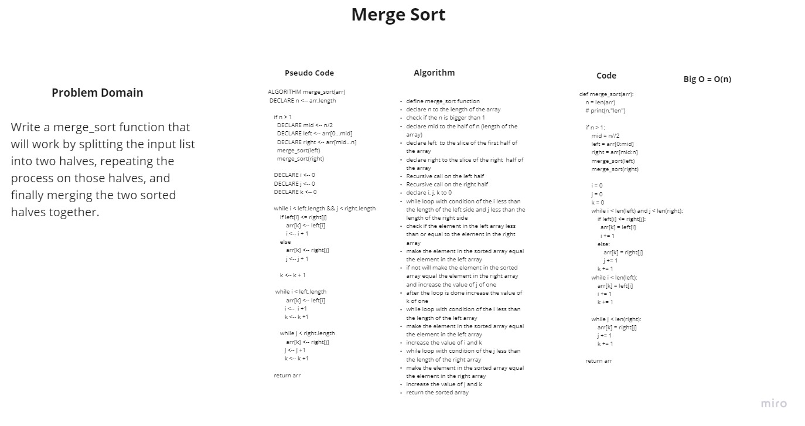

## Merge Sort

**Merge Sort function works by splitting the input list into two halves, repeating the process on those halves, and finally merging the two sorted halves together.**
## Whiteboiard 

## Whiteboard

[Pull Request](https://github.com/Rawan199812/401-data-structure/pull/12)