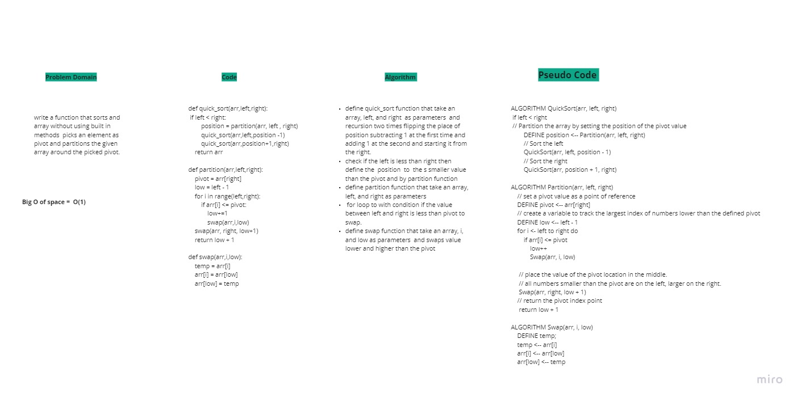

# Quick Sort

## quick _sort function is a divide and conquer algorithm. It picks an element as pivot and partitions the given array around the picked pivot. 

# Pull Request 
[Pull Request 1 ](https://github.com/Rawan199812/401-data-structure/pull/13)
[Pull Request 2 ](https://github.com/Rawan199812/401-data-structure/pull/13)

# WhiteBoard

