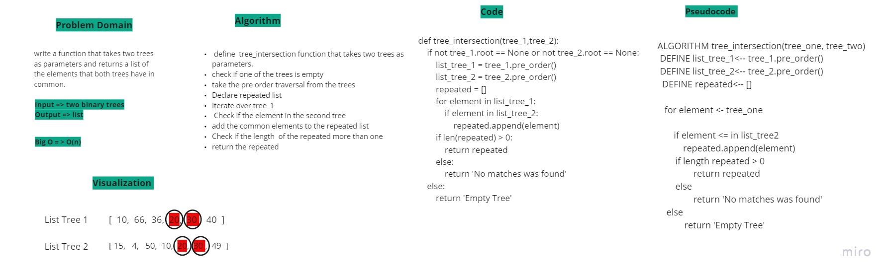

## Tree Intersection

### Problem domain
write a function that takes two trees as parameters and returns a list of the elements that both trees have in common.

### Challenge
Write a function called tree_intersection that takes two binary tree parameters. Without utilizing any of the built-in library methods available to your language, return a set of values found in both trees.

### Approach & Efficiency
time =>  O(n)
space => O(n)

### Whiteboard
